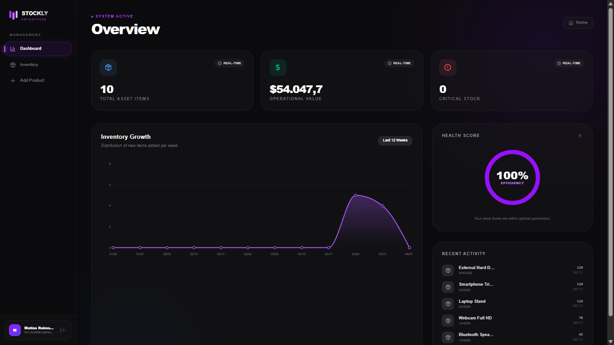

# Stockly App

## Live Demo
* **Live Application:** [View Live Demo](https://stockly-app-sigma.vercel.app/)

---

## Features

* Dashboard overview
* Product management (Create, Read, Delete)
* Search and filter inventory
* Stock tracking
* Authentication & session management
* PostgreSQL database integration
* Fast and optimized UI

---

## Tech Stack

This project is built using the following technologies:

* **Next.js 16.1.6**
* **Tailwind CSS 4 (via @tailwindcss/postcss)**
* **@stackframe/stack 2.8.71**
* **TypeORM 0.3.28**
* **PostgreSQL (pg 8.19.0)**

---

## Screenshot



---

## Installation

Clone the repository:

```bash
git clone https://github.com/MatiRaimondi1/Stockly-App.git
cd Stockly-App
```

Install dependencies:

```bash
npm install
```

---

## Environment Variables

Create a `.env` file in the root directory and configure the following variables:

```env
NEXT_PUBLIC_STACK_PROJECT_ID=your_stack_project_id
STACK_SECRET_SERVER_KEY=your_stack_secret_server_key
DATABASE_URL=your_postgres_database_url
```

---

## Database Setup

Make sure you have PostgreSQL installed and running.

Run migrations:

```bash
npm run migration:generate
npm run migration:run
```

---

## Development

Start the development server:

```bash
npm run dev
```

The app will be available at:

```
http://localhost:3000
```

---

## Production Build

```bash
npm run build
npm start
```

---

## Project Structure

```
/app            → Application routes (Next.js App Router)
/components     → Reusable UI components
/lib            → Database & utility configuration
/entities       → TypeORM entities
/public         → Static assets
```

---

## Authentication

Authentication and session handling are managed using **@stackframe/stack**, providing secure and scalable user management.

---
